# Vows & Vibe

**See it. Style it. Love it.**

## Problem

Coordinating bridal-party outfits is fragmented across group chats, reference photos and separate shopping decisions. Brides struggle to communicate a consistent color direction, and names such as “sage” or “emerald” can describe very different shades from one store to another. Bridesmaids want the freedom to choose a dress they love, but they cannot easily tell whether it fits the bride’s palette, how it will look on them or how it will sit alongside the rest of the party before committing. The result is guesswork, returns and repeated back-and-forth.

## Solution

Vows & Vibe brings that process into one Android app. The bride defines the wedding style and color palette, invites each bridesmaid and reviews everyone together in a shared lineup.

Bridesmaids remain free to explore dresses beyond the bride’s exact picks. The app compares a dress color with the bride’s selected palette using CIEDE2000, a perceptual color-distance measure. A shade that falls close to a selected palette color is shown as a **Family Match**—for example, willow green may coordinate closely with eucalyptus. A dress in the same broader color family but outside that close-match threshold is shown as a **Related Shade**. Bridesmaids can understand where their confirmed look fits, while the bride can filter the lineup using those relationships. Each participant can also virtually try on dresses, confirm a look and exchange private suggestions with the bride.

## End-to-end user journeys

```mermaid
flowchart LR
  subgraph Bride["Bride journey"]
    direction TB
    B1["Open the Android app"] --> B2["Sign in with Google"]
    B2 --> B3["Create one wedding event"]
    B3 --> B4["Define the wedding style and color palette"]
    B4 --> B5["Share the private invitation"]
    B5 --> B6["Upload a fitting photo and take a guided selfie"]
    B6 --> B7["Explore dresses with virtual try-on"]
    B7 --> B8["Confirm the bride's look"]
    B8 --> B9["Review confirmed party looks"]
    B9 --> B10["Use the Wedding Pass for Pro collaboration"]
    B10 --> B11["Exchange private suggestions"]
    B11 --> B12["Arrange and filter the shared lineup"]
    B12 --> B13["Save the lineup, export it or generate a group preview"]
  end

  subgraph Bridesmaid["Bridesmaid journey"]
    direction TB
    M1["Open the invitation in the app"] --> M2["Enter her name"]
    M2 --> M3["Review the event summary and palette"]
    M3 --> M4["Upload a fitting photo and take a guided selfie"]
    M4 --> M5["Choose an example dress or upload her own"]
    M5 --> M6["Explore the dress with virtual try-on"]
    M6 --> M7["See Family Match or Related Shade when applicable"]
    M7 --> M8["Confirm one look"]
    M8 --> M9["View the shared lineup and group preview"]
    M9 --> M10["Exchange private suggestions with the bride"]
    M10 -. "Change the look if needed" .-> M5
  end

  B5 -. "Android App Link" .-> M1
  M8 -. "Confirmed look joins the party" .-> B9
  B11 -. "Send suggestion" .-> M10
  M10 -. "Reply privately" .-> B11
  B13 -. "Saved party view" .-> M9

  classDef bride fill:#fff1f2,stroke:#be617c,color:#292524;
  classDef bridesmaid fill:#faf7f2,stroke:#a8a29e,color:#292524;
  class B1,B2,B3,B4,B5,B6,B7,B8,B9,B10,B11,B12,B13 bride;
  class M1,M2,M3,M4,M5,M6,M7,M8,M9,M10 bridesmaid;
```



The Android application is located in [`mobile/`](mobile/). Server-side APIs, authentication callbacks and invitation services are maintained at the repository root and deployed on Vercel.

## Download the Android app

[Download the latest Vows & Vibe APK](https://github.com/areebaaqeel-dot/vows-vibes/releases/latest/download/vowsvibe-android-debug.apk)

Install the downloaded APK on an Android device.

- **Current release:** `v1.0.0` — updated September 30, 2026
- **SHA-256:** `d3ddf51008eb651423688c42a70325607a1923182da7635cc2a8684de980c2b3`

- **Android package:** `com.vowsvibe.mobile`
- **Mobile source:** [`mobile/src/`](mobile/src/)
- **Native Android project:** [`mobile/android/`](mobile/android/)

## Product overview

- Google sign-in and event management for the bride
- Invite-link entry for bridesmaids without separate accounts
- Android App Links that open invitations directly in the installed app
- Full-body dress virtual try-on powered by Perfect Corp YouCam
- Guided selfie capture for skin-tone and undertone guidance
- Bride and bridesmaid dress rails with saved try-on history
- Shared bridal-party lineup with drag, layering and color filters
- Direct suggestion conversations between the bride and each bridesmaid
- Venue group previews powered by Qwen Image
- Saved lineup state and PNG export
- One-time RevenueCat Wedding Pass with shared party access

## Bride workflow

The bride signs in with Google and can:

1. Create and manage one wedding event.
2. Set the date, dress direction, fabric, length and color palette.
3. Add example dresses and share the private invitation link.
4. Upload a full-body photo and capture one guided skin-tone selfie.
5. Generate and save virtual try-on previews.
6. Confirm her final look.
7. Arrange confirmed party members in the lineup canvas.
8. Filter the lineup by palette relationship.
9. Open a bridesmaid list and enter an individual suggestion conversation.
10. Generate a venue group preview or export the arranged lineup.

The bride can also delete the event and its associated participant photos, dresses, previews, messages and lineup data.

## Bridesmaid workflow

A bridesmaid opens the wedding invitation, enters her name and receives a private fitting session. She can:

1. Review the bride’s event summary and palette.
2. Upload a full-body photo.
3. Capture a guided selfie for personal color guidance based on her undertone.
4. Choose an example dress or upload her own dress.
5. Generate virtual try-ons and revisit saved previews.
6. Confirm one look for the shared lineup.
7. View the lineup and the bride’s saved group preview.
8. Exchange suggestions directly with the bride.

Bridesmaids cannot message other bridesmaids. The bride has a separate conversation for each bridesmaid, while a bridesmaid opens directly into her conversation with the bride.

## Color guidance

The app keeps color guidance simple and advisory:

- A guided selfie produces a saved skin-tone value and warm, cool or neutral undertone classification.
- The color guide shows shades that generally complement that undertone and shades that may appear less balanced.
- The event summary can place an undertone-aware **Suggested match** beside suitable colors from the bride’s palette.
- Bridesmaid dress cards can show **Family Match** when a shade coordinates closely with the wedding palette.
- Bridesmaid dress cards can show **Related shade** when a color belongs to the same family but is noticeably lighter, darker or different.
- No badge is shown when a bridesmaid dress is neither a Family Match nor a Related shade.
- The bride’s lineup canvas retains Palette Match, Family Match, Related shade and Different family filtering.

skin tone classification use CIE Lab conversion and Palette relationships uses CIEDE2000 distance where perceptual comparison is useful. Results are styling suggestions rather than scientific or mandatory rules; lighting, cameras, fabric and personal preference still matter.

## Virtual try-on and privacy

The full-body photo is uploaded to the wedding’s private fitting workflow and is removed when the event is deleted. The separate guided selfie is sent to Perfect Corp for analysis in memory and is not saved to Supabase Storage. Only the derived skin, hair and undertone values are retained.

Virtual try-on attempts are stored in `vto_attempts`, allowing each participant to revisit previous successful previews and confirm one final look. Confirmed looks receive background-removed cutouts for the shared lineup.

## Suggestions

Suggestions use the Supabase message and Realtime:

- Bride → bridesmaid is allowed.
- Bridesmaid → bride is allowed.
- Messages are organized into individual conversations.
- Suggestions remain tied to the recipient’s current confirmed look, so stale look-specific messages are not shown after that look changes.

## RevenueCat Wedding Pass

The Android app uses RevenueCat for a one-time **Vows & Vibe Pro Wedding Pass**.

### Access model

- The bride purchases the pass once for her wedding.
- RevenueCat customer identity uses the signed-in bride’s Supabase user UUID.
- The active entitlement ID is `vows_vibes_pro`.
- Invited bridesmaids inherit the bride’s verified entitlement and never purchase separately.
- The free bride plan supports one wedding, two dress uploads, two successful bride try-ons and one saved bride skin-tone analysis.
- Pro supports eight total successful try-ons per participant, one saved skin-tone analysis per participant, unlimited dress uploads, suggestions, lineup saving/export and group previews.
- Try-on allowances are totals for the wedding and do not reset.


## Shared lineup and group preview

Confirmed participant cutouts appear in a Fabric.js canvas controlled by the bride. The bride can reposition people, adjust layering, hide participants, filter by palette relationship, save the arrangement and export a PNG.

For a polished group preview, the bride can add a venue image and generate a composition through an image-generation model. A saved preview becomes visible to the bridal party.

## Mobile architecture and supporting services

- **Android app:** Capacitor 8 with a bundled Vite/React frontend
- **Supporting backend:** Next.js 16 API routes, authentication callbacks and invitation endpoints deployed on Vercel
- **Auth, database, storage and realtime:** Supabase
- **Purchases and entitlements:** RevenueCat Capacitor SDK plus server-side verification and webhooks
- **Virtual try-on and skin analysis:** Perfect Corp YouCam APIs
- **Lineup canvas:** Fabric.js
- **Background removal:** `@imgly/background-removal-node`
- **Group preview:** Alibaba Cloud Model Studio / Qwen Image

## Repository map

```text
src/                          # Supporting Next.js backend and shared application code
├── app/api/                 # Deployed events, VTO, billing and webhook endpoints
├── components/              # Shared bride, bridesmaid, lineup and conversation UI
└── lib/
    ├── billing/             # RevenueCat verification and cached entitlement state
    ├── color/               # Undertone guide and palette relationships
    ├── cutout/              # Confirmed-look background removal
    ├── suggestions/         # Bride/bridesmaid conversation permissions
    ├── supabase/            # Server and browser Supabase clients
    └── youcam/              # Perfect Corp integration

mobile/                       # Android application
├── android/                 # Native Android project
├── src/                     # Bundled mobile application and native integrations
└── capacitor.config.ts      # Android app configuration

supabase/
├── migrations/              # RevenueCat and VTO usage-tracking migrations
└── schema.sql               # Complete database schema
```
